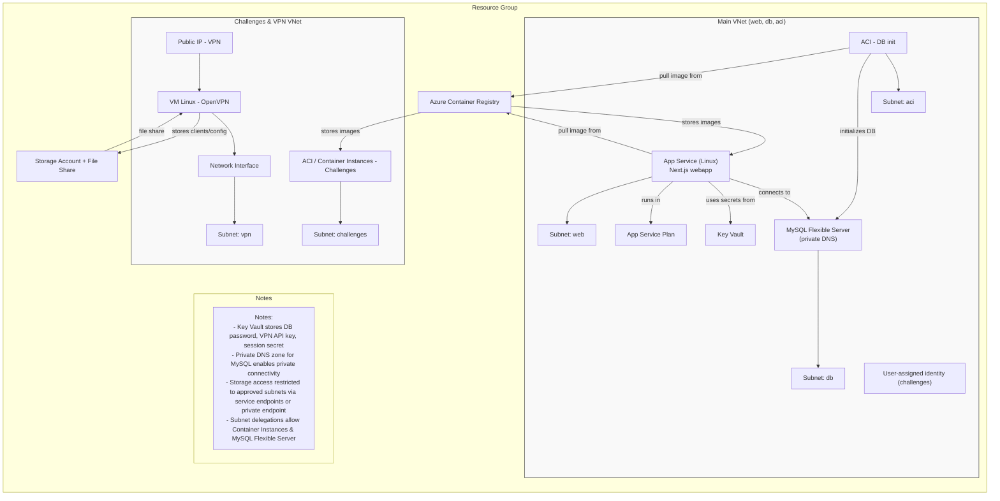

# RootQuest — plateforme de pentest - Groupe 8

RootQuest est une plateforme d'entraînement au pentest (lab / CTF) visant à fournir des environnements vulnérables et reproductibles pour l'apprentissage et la formation. Le dépôt contient :

- Une collection d'images et de services vulnérables (ex. dossiers dans `data/` comme `apocalypse`, `cyberspace1`, `detective`, `jailbreak*`) exposant des applications web et services réseau intentionnellement vulnérables.
- Une interface web utilisateur basés sur Next.js (dossier `rootquest/`) pour gérer les sessions, les scores et l'accès.
- Des fichiers Terraform (dossier `terraform/`) pour déployer l'infrastructure (Azure).

Technologies principales : Docker, Nginx/PHP pour les challenges web, Next.js/Node pour la webapp, MySQL pour la base de données, et Terraform/Azure pour l'infrastructure.


# Infrastructures 

## Description de l'infrastruture utilisée

RootQuest est déployée principalement sur Microsoft Azure et utilise une architecture orientée conteneurs et services managés pour fournir des environnements de pentest isolés et reproductibles. Les fichiers Terraform du dossier `terraform/` orchestrent la création des ressources suivantes :

- Un Resource Group Azure qui contient l'ensemble des ressources du projet.
- Deux Virtual Networks séparés :
	- un VNet "challenges" dédié aux challenges et au VPN (subnets : `vpn`, `challenges`),
	- un VNet principal pour les services (subnets : `web`, `db`, `aci`).
- Un serveur MySQL Flexible (déployé en subnet `db`) avec zone DNS privée pour sécuriser l'accès depuis la webapp.
- Un Azure Container Registry (ACR) pour stocker les images Docker des challenges, de la webapp et des outils d'initialisation.
- Une App Service Linux (webapp) exécutant l'interface Next.js depuis une image tirée du ACR. La webapp utilise une identité managée et reçoit les rôles nécessaires pour puller les images.
- Des delegations de subnet et Azure Container Instances (ACI) pour exécuter les services des challenges dans des conteneurs isolés.
- Une VM Linux dédiée exécutant le serveur OpenVPN avec une IP publique statique ; les fichiers clients OpenVPN sont partagés via un Storage Account (Azure File Share).
- Un Storage Account + File Share utilisé notamment pour stocker les configurations/clients OpenVPN et autres artefacts partagés.
- Un Azure Key Vault qui contient les secrets critiques (mot de passe MySQL, clef API VPN, secret de session, clé du storage) et qui est lié à la webapp via des access policies.
- Des scripts d'amorçage (ex. `scripts/install-vpn.sh`) et des tâches d'initialisation (ACI/containeurs) pour préparer la base de données et démarrer les services.


## Schéma d'architecture





## Déploiement

### Prérequis, sur votre machine locale :

- Azure CLI installé et authentifié (az login).

- Terraform installé.

- Docker installé et lancé (pour construire les images).


## Déploiement de l'Infrastructure avec teraform

### Préparation

- Placez le fichier SQL d'initialisation dans terraform/db-init/init-db.sql. **(BIEN REMPLACER PAR LE COMPLET FOURNI, CELUI PRESENT SUR GIT NE FOURNIT QUE LA STRUCTURE)**

- Créez le fichier terraform/terraform.tfvars en s'aidant de l'exemple ci-dessous

```tf
# terraform/terraform.tfvars
project_name         = "rootquest"
environment          = "dev"
location             = "switzerlandnorth" #ou autre region dispo dans l'abonnement
mysql_admin_password = "<password>" #en préciser un
mysql_admin_username = "rootquest" #par exemple

mysql_version        = "5.7"
app_service_sku      = "B1"
acr_sku             = "Basic
```

### Lancement

Dans le dossier terraform/, executer les commandees suivantes
```sh
terraform init
terraform plan
terraform apply -auto-approve
```

Décommentez le fichier database-init.tf


### Push des images

Push tous les images dans l'acr (un script d'installation est prévu à cet effet)

```sh
./scritps/push_containers.sh
```
Si l'image de la webapp ne s'est pas push

```sh
docker build -t rootquestdevacr.azurecr.io/rootquest:latest .
docker push rootquestdevacr.azurecr.io/rootquest:latest  
```


### Deuxieme apply

Pour initier la db.

```sh
terraform plan
terraform apply -auto-approve
```


#### clef privé ssh

Si vous souhaitez pouvoir vous connecter en ssh a la VM openvpn, assurez-vous d'avoir une clé publique ssh sur votre machine a l'emplacement précisé dans le fichier terraform/vpn.tf ligne 54. Sinon, supprimer la partie sur l'accès ssh.